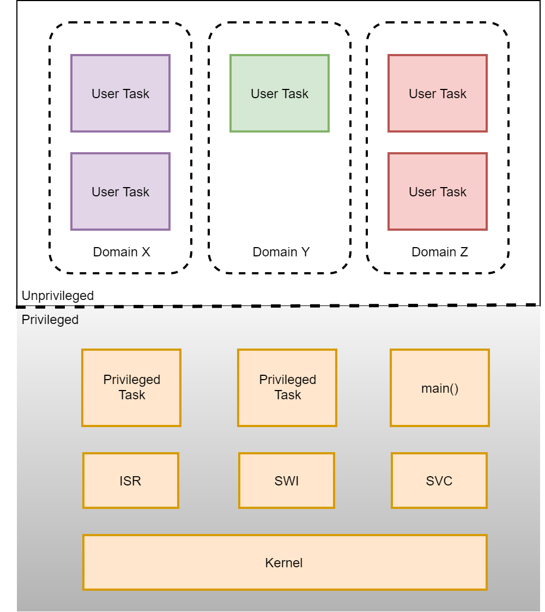
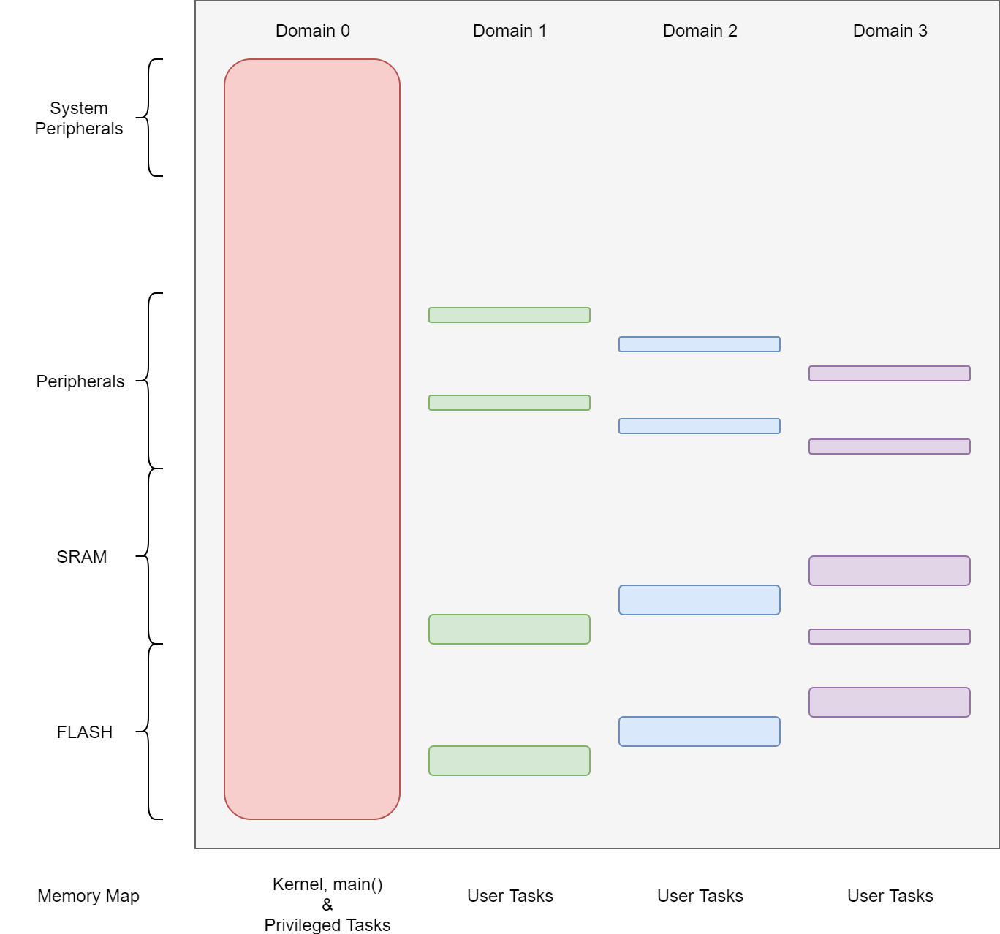

=========================================================
 TI-RTOS Memory Protection Extensions (MPE) Architecture
=========================================================

Introduction
============

TI-RTOS MPE is an extension to the TI-RTOS Kernel that adds memory
protection capability. With this extension, an application can restrict
the memory and peripherals a Task can access, thereby creating a
sandbox. The access restricted tasks run in unprivileged mode and are
therefore also restricted in terms of the type of CPU instructions they
can execute. For example, an access restricted or unprivileged task
cannot disable interrupts directly.

TI-RTOS MPE can be used to enhance the security of applications by
compartmentalizing the application into mutually isolated tasks. In the
simplest configuration, the security critical portions of the
application can be moved to privileged tasks and the rest of the
application can be run as unprivileged tasks. In a more advanced
configuration, multiple mutually isolated tasks may be used to
compartmentalize the application at a finer level of granularity.

Motivation
==========

Keystone 3 Platform has a need to isolate 2 different sets of software
modules from one another in order to satisfy security certification
requirements. TI-RTOS Kernel was chosen as the RTOS of choice and must
be extended to support task isolation. The proposed architecture is
expected to satisfy these requirements.

Next generation of SimpleLink CMCU devices will be heavily focused on
security. An RTOS with memory protection capability is well suited for
the security goals of these devices. The proposed architecture is
expected to also enhance the RTOS security offering on next generation
SimpleLink CMCU devices.

Assumptions
===========

It is assumed that the reader is familiar with the overall architecture
of the TI-RTOS Kernel and ARMv7-M architecture.

Definitions, Abbreviations, Acronyms
====================================

+-------------+------------------------------------------------------------------------+
| **Term**    | **Definition**                                                         |
+=============+========================================================================+
| ACL         |Access Control List - A list specifying the base address and length of  |
|             |memory regions a task can access along with the access permissions (RD, |
|             |WR, EX) for each region                                                 |
+-------------+------------------------------------------------------------------------+
| API         |Application Programming Interface                                       |
+-------------+------------------------------------------------------------------------+
| CMCU        |Connected MCU - A business unit in EP                                   |
+-------------+------------------------------------------------------------------------+
| DoS Attack  |Denial Of Service attack - A type of security attack wherein the CPU    |
|             |resource is made unavailable to regular processing tasks                |
|             |                                                                        |
+-------------+------------------------------------------------------------------------+
| Keystone3   |Next generation platform from EP Processor's group                      |
+-------------+------------------------------------------------------------------------+
| MCU         |Micro-Controller Unit                                                   |
+-------------+------------------------------------------------------------------------+
| MPU         |Memory Protection Unit - An optional memory protection hardware present |
|             |on some Cortex-M devices like MSP432                                    |
+-------------+------------------------------------------------------------------------+
| Privileged  |A TI-RTOS Task that runs in privileged thread mode and has no memory    |
| Task        |access restrictions                                                     |
+-------------+------------------------------------------------------------------------+
| TI-RTOS     |Texas Instruments Real Time Operating System                            |
+-------------+------------------------------------------------------------------------+
| Unprivileged|A TI-RTOS Task that runs in unprivileged thread mode and has a          |
| Task        |restricted set of memory regions it can access with predefined access   |
|             |permissions (RD, WR, EX)                                                |
+-------------+------------------------------------------------------------------------+
| User Task   |Alias for Unprivileged Task                                             |
+-------------+------------------------------------------------------------------------+

References
==========

ARMv7-M Architecture Reference
Manual, https://static.docs.arm.com/ddi0403/e/DDI0403E_B_armv7m_arm.pdf

SYS/BIOS (TI-RTOS Kernel) User's
Guide, http://downloads.ti.com/dsps/dsps_public_sw/sdo_sb/targetcontent/bios/sysbios/6_50_01_12/exports/bios_6_50_01_12/docs/Bios_User_Guide.pdf

Revision History
================

+---------------+------------------+------------------------+--------------------------------------------+
| **Date**      | **Author**       | **Document Version**   | **Change Description**                     |
+===============+==================+========================+============================================+
| Jun 8, 2017   |  Ashish Kapania  | v0.1                   | Initial Document                           |
+---------------+------------------+------------------------+--------------------------------------------+
| Jun 9, 2017   |  Ashish Kapania  | v0.2                   |Updates based on feedback from review with  |
|               |                  |                        |Alan DeMars , Karl Wechsler , David Russo & |
|               |                  |                        |Mark Grosen                                 |
+---------------+------------------+------------------------+--------------------------------------------+
| Jul 6, 2017   |  Ashish Kapania  | v0.3                   |Update examples and description. Add Domain |
|               |                  |                        |concept, Architectural Elements and other   |
|               |                  |                        |minor improvements.                         |
+---------------+------------------+------------------------+--------------------------------------------+
| May 30, 2019  |  Gil Pitney      | v0.4                   |Converted to reST format                    |
|               |                  |                        |                                            |
|               |                  |                        |                                            |
+---------------+------------------+------------------------+--------------------------------------------+

Requirements
============

TI-RTOS Kernel shall support privileged and unprivileged Tasks
--------------------------------------------------------------

An unprivileged task by definition can only access memory and
peripherals allowed by its Access Control List (ACL). It cannot access
any privileged code or data. A privileged task on the other hand, can
access any memory or peripheral in the system.

This requirement is derived from SYSFW-128 - Partitioning of tasks using
supervisor/user.

TI-RTOS Kernel shall support De-Privileged Interrupts
-----------------------------------------------------

TI-RTOS Kernel shall support de-privileging interrupts. An interrupt
registered by unprivileged code cannot be trusted and must be serviced
in unprivileged mode.

It should be noted that de-privileging interrupts adds a significant
overhead. On Cortex-M devices in particular, it requires making an SVC
call to drop ISR privilege level and another SVC call to elevate the
privilege level. In addition, in order to preserve interrupt
prioritization, the NVIC interrupt priority registers also have to be
modified.

An alternative to de-privileging interrupts is for the system integrator
to carefully review and approve any function registered as an ISR so it
can be trusted. This eliminates the need to reduce the ISR's privilege
level.

***This feature shall not be supported in the first TI-RTOS Kernel
product release.***

Functional Overview
===================

TI-RTOS MPE extends the TI-RTOS Kernel to add memory protection
capability. With this extension, an application can configure at task
creation time, the privilege level a task will run at and the access
privileges of the task.

A Task configured to run in privileged mode is referred to as a
*Privileged Task* and a Task configured to run in unprivileged mode is
referred to as an *Unprivileged Task* or *User Task* in this
document. A  *Privileged Task* has no memory access restrictions and
can access any valid memory in the device's memory map.
An  *Unprivileged Task* a.k.a. * User Task * on the other hand can
only access memories allowed by its ACL. In addition to the memory
access restrictions, a User Task can only call a limited set of TI-RTOS
Kernel APIs. No such restrictions exist for Privileged Tasks.

Each User Task must be associated with a domain and inherits its ACL
from the domain. A *Domain* is a protected environment that owns a fixed
set of memory regions defined by its ACL. A domain may contain one or
more User Tasks. A Task created by a User Task automatically gets added
to its parent Task's domain. A User Task cannot create Privileged Tasks
or User Tasks for other domains.

TI-RTOS MPE provides wrapper functions for Kernel APIs that are callable
from User Tasks. These wrapper functions serve as entry points for
Kernel APIs as a User Task cannot directly call Kernel APIs. The wrapper
function is responsible for switching execution into privileged mode
before calling the kernel API and restoring the privilege level upon
return from the kernel API. These wrapper functions are provided for
select APIs from a limited set of kernel modules. The list of kernel
module and their APIs, that will have a wrapper function, will be
published in this document at a future time by the TI-RTOS Kernel team.

Architectural Elements
======================

.. Requirement
   | REQ_TAG(SYSBIOS-571), REQ_TAG(SYSBIOS-1009), REQ_TAG(SYSBIOS-1010), REQ_TAG(SYSBIOS-1011)
   | REQ_TAG(SYSBIOS-1012), REQ_TAG(SYSBIOS-1013), REQ_TAG(SYSBIOS-1014), REQ_TAG(SYSBIOS-1015)
   | REQ_TAG(SYSBIOS-1016), REQ_TAG(SYSBIOS-1017), REQ_TAG(SYSBIOS-1018),REQ_TAG(SYSBIOS-1019)

Execution Domain
----------------

TI-RTOS MPE introduces the notion of execution domains. A Domain is a
protected environment for the kernel and tasks to execute within and has
an ACL that is defined at the time of creating the domain. The kernel
and privileged tasks execute in a special domain that allows them to
access the entire address space. User Task domains are more restrictive
and allow a user task to only access memory regions explicitly owned by
the domain or memory regions that are public and accessible to all
domains.

A domain can be created in main() or a privileged task only. A User Task
is assigned to an existing domain at the time of its creation. A User
Task may create more threads which inherit its domain. A User Task
cannot assign any other domain to the threads it creates.

Memory Partitioning
-------------------

In order to achieve the domain partitioning shown in the above section,
application code and data must be partitioned and placed in their own
sections. These sections are carefully placed in memory by the linker.
Domain ACL entries are defined to provide protection for these sections.

In addition to the user domain sections, an application must include 2
predefined types of sections - privileged sections and public sections.

Privileged Sections
~~~~~~~~~~~~~~~~~~~

Each application must include 3 types of privileged sections, namely
".privileged\_code", ".privileged\_data" and ".privileged\_bss".
Privileged sections contain the code and data belonging to the kernel
and privileged tasks.

Privileged Code
^^^^^^^^^^^^^^^

This section contains the kernel code. An application may place its own
functions in this section if they are part of a privileged task and must
not be readable or executable from User tasks.

**Privileged Code Section Placement**

::

    #pragma CODE_SECTION (<func name>, ".privileged_code")

Privileged Data
^^^^^^^^^^^^^^^

This section contains the kernel data. An application must place static
kernel objects in either privileged data or bss memory. If an
application passes a kernel object not in one of the privileged
sections, to the kernel, the kernel object validation will fail. A
Task\_construct() call for example must be passed a pointer to a
Task\_Struct object that is in privileged data or bss memory.

An application may choose to store global memory used by a privileged
task in this memory region to protect it against accesses from User
Tasks.

**Privileged Data Section Placement**

::

    #pragma DATA_SECTION (<var name>, ".privileged_data")

Privileged Bss
^^^^^^^^^^^^^^

This section contains the kernel heap and any uninitialized global
kernel data. An application must place static kernel objects in either
privileged data or bss memory. If an application passes a kernel object
not in one of the privileged sections, to the kernel, the kernel object
validation will fail. A Task\_construct() call for example must be
passed a pointer to a Task\_Struct object that is in privileged data or
bss memory.

An application may choose to store global memory used by a privileged
task in this memory region to protect it against accesses from User
Tasks.

**Privileged Data Section Placement**

::

    #pragma DATA_SECTION (<var name>, ".privileged_bss")

Public Sections
~~~~~~~~~~~~~~~

Each application must include 3 types of public sections, namely
".public\_code", ".public\_data" and ".public\_bss". All application
code and data goes into one of these sections, unless it is explicitly
placed into a different section. These public sections are accessible
from all domains and either privilege modes.

Public Code
^^^^^^^^^^^

All application code that is not explicitly placed is contained within
this section. In other words, this is the default code section. All
functions contained within this section are callable from any User Task.

Public Data
^^^^^^^^^^^

All application initialized global data that is not explicitly placed is
contained within this section. All data contained within this section is
accessible from any User Task.

Public Bss
^^^^^^^^^^

All application uninitialized global data that is not explicitly placed
is contained within this section. All data contained within this section
is accessible from any User Task.

User Domain Sections
~~~~~~~~~~~~~~~~~~~~

A Domain can contain ACL entries to restrict access to its code and
data. For each such ACL entry, there needs to be a corresponding code
and/or data section defined. Names of these sections are not predefined
and left up to the application developer to choose.

For example, an application containing a domain with ACL entries for
code and data, could define sections ".domain1\_code" and
".domain1\_data", that contain the code and data specific to that
domain.

Heap
----

With TI-RTOS MPE, the default heap instance is treated as public and
placed in the the ".public\_bss" section. malloc() and free() calls
allocate memory from this heap. It should be noted that since
".public\_bss" is accessible by any task, critical information should
*not* be stored in this heap.

TI-RTOS MPE also provides a kernel heap that is placed in
".privileged\_bss" section. This heap is used to allocate kernel objects
when using dynamic create calls. Kernel heap size can be controlled
using "BIOS.privHeapSize" config param.

MPU Context
-----------

This section covers the programming of the memory protection hardware.
While the MPE architecture does not restrict what targets can be
supported, this document will focus only on Cortex-M memory protection.
Depending on the device, TI-RTOS kernel may use the ARM MPU or SoC
firewall for memory protection. The implementation details of the MPU
and SoC Firewall drivers are abstracted away by the MemProtect module.
The application as well as the core kernel modules interact with the
MemProtect module only. The MemProtect module internally interfaces with
a device specific MPU or Firewall module.

The MemProtect module supports dynamic creation of domains. The maximum
number of ACL entries each domain may contain is device specific and can
be determined using the "MemProtect\_MAX\_USER\_ACL\_ENTRIES" macro. The
domain ACL entries are translated into a memory protection hardware
specific format and stored. With the ARM MPU, each ACL entry is
translated into 2 register entries. All the User ACL MPU entries
together are referred to as the domain's MPU context. The domain MPU
context is switched on every task context switch (if previous and next
task's domains are different). In other words, part of the MPU is
reprogrammed.

In addition to dynamic MPU context, the MemProtect module is responsible
for initializing a static MPU context. The static MPU context is
composed of ACL entries for sections such as public code, public data,
public bss and kernel wrapper functions. These memory regions are marked
as accessible from User Tasks. The static MPU context is always mapped.
On MPU and Firewall based devices, it is programmed once during startup.
On MMU based devices, it is part of each domain's MMU table.

System Call (SVC) Interface
---------------------------

.. Requirement
   | REQ_TAG(SYSBIOS-569), REQ_TAG(SYSBIOS-1075), REQ_TAG(SYSBIOS-1076), REQ_TAG(SYSBIOS-1077)
   | REQ_TAG(SYSBIOS-1078)

TI-RTOS MPE provides 3 system calls for switching between privileged and
unprivileged execution modes. The 3 system calls are described below:

SysCall\_enterPrivMode()
~~~~~~~~~~~~~~~~~~~~~~~~

This system call switches CPU execution mode to privileged and returns
to the caller. In order to ensure that User Tasks cannot elevate their
execution privilege, the system call handler validates the caller's PC
to ensure it falls in the kernel wrapper function memory region. If a
User Task attempts to make this system call, the request will fail and a callback
function will be called. The default callback registered by the kernel
will raise an error.

SysCall\_enterUnprivMode()
~~~~~~~~~~~~~~~~~~~~~~~~~~

This system call switches CPU execution mode to unprivileged and returns
to the caller.

SysCall\_restorePrivMode()
~~~~~~~~~~~~~~~~~~~~~~~~~~

This system call restores the CPU execution mode to the currently active
task's privilege level. For example, if a privileged task calls
SysCall\_restorePrivMode(), execution mode will be set to privileged.
This system call also validates that the caller's PC falls in the kernel
wrapper function memory region.

**NOTE: The above APIs should not be used by a privilege task to
temporarily drop to unprivileged mode in order to execute a block of
code as these APIs do not switch the stack and running an unprivileged
function on a privileged stack will result in a fault. In other words,
SysCall\_enterUnprivMode() -> func call ->
SysCall\_enterPrivMode()/SysCall\_restorePrivMode() sequence should be
avoided. The recommended way to achieve this functionality is to unblock
an unprivileged task to run a block of code with restricted
privileges.**

Programming Interface
=====================

This section describes the programming interface for features added to
TI-RTOS Kernel as part of the memory protection extension. It should be
noted that the Kernel API names and signatures have not been modified.

TI-RTOS Task Domain Creation
----------------------------

TI-RTOS MPE adds a new MemProtect module that has APIs to create a
domain. The domain create function accepts a pointer to an ACL table.
The max supported length of the ACL table depends on the architecture
being targeted.

**MemProtect Types**

::

    typedef struct MemProtect_AclEntry {
        UInt32 rbar;
        UInt32 rasr;
    } MemProtect_AclEntry;

    typedef struct MemProtect_Struct {
        UInt32 magicNumber;
        MemProtect_AclEntry acl[MemProtect_NUM_USER_ACL_ENTRIES];
    } MemProtect_Struct;

**MemProtect APIs**

::

    MemProtect_Handle MemProtect_createDomain(MemProtect_Acl *acl, UInt16 aclLength);
    Void MemProtect_deleteDomain(MemProtect_Handle handle);
    Int MemProtect_constructDomain(MemProtect_Struct *obj, struct MemProtect_Acl *acl, UInt16 aclLength);
    Void MemProtect_destructDomain(MemProtect_Struct *obj);

**MemProtect Domain Creation Example**

::

    #include <xdc/std.h>

    #include <ti/sysbios/BIOS.h>
    ...
    #include <ti/sysbios/hal/MemProtect.h>

    MemProtect_Struct memProtect;

    extern Ptr _domain0_code_begin;
    extern Ptr _domain0_code_end;
    extern Ptr _domain0_data_begin;
    extern Ptr _domain0_data_end;

    Int main(Int argc, Char* argv[])
    {
        MemProtect_Acl acl[2] = {
            {
                (Ptr)&_domain0_code_begin,
                (SizeT)(&_domain0_code_end) - (SizeT)(&_domain0_code_begin),
                MemProtect_USER_READ | MemProtect_USER_EXEC | MemProtect_WRITETHROUGH
            },
            {
                (Ptr)&_domain0_data_begin,
                (SizeT)(&_domain0_data_end) - (SizeT)(&_domain0_data_begin),
                MemProtect_USER_READ | MemProtect_USER_WRITE | MemProtect_WRITETHROUGH | MemProtect_SHAREABLE
            }
        };

        MemProtect_constructDomain(&memProtect, acl, sizeof(acl)/sizeof(MemProtect_Acl));

        ...
        BIOS_start();
        return (0);
    }

TI-RTOS Task Creation
---------------------

Task\_Params has new fields to determine the privilege level of the task
and domain assignment if the Task is unprivileged.

**Task\_Params Structure**

::

    typedef struct Task_Params {
        ...
        Bool privileged;
        // Privileged Task ?
        Ptr domain;
        // Task Domain handle
    } Task_Params;

The *TaskParams.privileged* field is *TRUE* by default and must be set
to *FALSE* to create a User Task. The *TaskParams.domain* field is the
domain handle for a User Task. This field is ignored if
*TaskParams.privileged* is *TRUE* or if creating a Task from within a
User Task.

**Task Create Example**

::

    #include <xdc/std.h>
    #include <xdc/runtime/Error.h>

    #include <ti/sysbios/knl/Task.h>
    #include <ti/sysbios/hal/MemProtect.h>

    MemProtect_Struct memProtect;

    extern Ptr _domain0_code_begin;
    extern Ptr _domain0_code_end;
    extern Ptr _domain0_data_begin;
    extern Ptr _domain0_data_end;

    Task_Handle tsk;
    extern Void tsk_func(UArg arg0, UArg arg1);

    Void main() {
        Task_Params params;
        MemProtect_Acl acl[2] = {
            {
                (Ptr)&_domain0_code_begin,
                (SizeT)(&_domain0_code_end) - (SizeT)(&_domain0_code_begin),
                MemProtect_USER_READ | MemProtect_USER_EXEC | MemProtect_WRITETHROUGH
            },
            {
                (Ptr)&_domain0_data_begin,
                (SizeT)(&_domain0_data_end) - (SizeT)(&_domain0_data_begin),
                MemProtect_USER_READ | MemProtect_USER_WRITE | MemProtect_WRITETHROUGH | MemProtect_SHAREABLE
            }
        };

        MemProtect_constructDomain(&memProtect, acl, sizeof(acl)/sizeof(MemProtect_Acl));

        Task_Params_init(&params);
        params.privileged = FALSE;
        params.domain = &memProtect;
        params.aclLength = sizeof(aclTsk0) / sizeof(MemProtect_ACL_t) ;
        tsk = Task_create(&tsk_func, &params, Error_Ignore);
        ...
        BIOS_start();
    }

TI-RTOS Kernel API Calls
------------------------

TI-RTOS Kernel provides wrapper functions for selected APIs from
selected kernel modules. The wrapper functions are provided as an
interface to the Kernel APIs as unprivileged tasks cannot make direct
function calls to Kernel APIs as they run in privileged thread mode.
Corresponding to each wrapper function there is a function long name to
wrapper function long name mapping. Wrapper functions are placed in a
common section ".kernel\_wrapper\_funcs" and are callable from User
tasks.

**Module Header**

::

    Semaphore.h:
    #if defined(ti_sysbios_Build_useSvcWrappers)
    ...
    #undef ti_sysbios_knl_Semaphore_pend
    #define ti_sysbios_knl_Semaphore_pend ti_sysbios_knl_Semaphore_pend_SVC__E
    extern xdc_Bool ti_sysbios_knl_Semaphore_pend_SVC__E(ti_sysbios_knl_Semaphore_Handle *sem, xdc_UInt32 timeout);
    ...
    #endif

When creating a wrapper function, care must be taken to ensure that the
SysCall\_enterPrivMode() call is followed by code that either jumps to
an absolute address or reads the function address from code memory and
jumps to it. Allowing code to jump to a function address passed as a
register argument or to read a function address from the stack and jump
to it, will result in a security vulnerability. An attacker can place
their attack function address on the stack or in a CPU register and
directly jump to the SysCall\_enterPrivMode() call site in the wrapper
function.

**Kernel API Wrapper**

::

    Semaphore.c:
    /*
     *  ======== Semaphore_pend_SVC ========
     */
    Bool ti_sysbios_knl_Semaphore_pend_SVC(Semaphore_Object *sem, UInt32 timeout)
    {
        Bool ret;

        SysCall_enterPrivMode();
        ret = Semaphore_pend(sem, timeout);
        SysCall_enterUnprivMode();

        return (ret);
    }

C/C++ files containing unprivileged task code must define the
*ti_sysbios_Build_useSvcWrappers*  macro in order to link with
wrapper functions. If this macro is not defined, then Kernel calls from
unprivileged code will generate a fault.

**Kernel API Call Example**

::

    UnprivilegedTask.c:
    #include <xdc/std.h>

    #define ti_sysbios_Build_useSvcWrappers
    #include <ti/sysbios/knl/Task.h>

    #pragma CODE_SECTION(tsk0_func, ".domain0_text")
    Void tsk0_func(UArg arg0, UArg arg1)
    {
        ...
        Task_yield();
        ...
    }

    PrivilegedTask.c:
    #include <xdc/std.h>
    #include <ti/sysbios/BIOS.h>
    #include <ti/sysbios/knl/Semaphore.h>

    Void tsk1_func(UArg arg0, UArg arg1)
    {
        ...
        Semaphore_pend(sem0, BIOS_WAIT_FOREVER);
        ...
    }

Interrupt Handling
------------------

In the initial version of TI-RTOS MPE, all interrupts will run as
privileged. Hwi\_create/construct calls will not be allowed from User
Tasks to prevent them from defining a Hwi and running their function as
privileged. In future versions with interrupt de-privileging support,
interrupts can be added to a User Task's ACL so a User Task can create
Hwi's only for the interrupts it owns.

C Standard Library
------------------

C standard library functions and their corresponding global data is
placed in the public code and data sections. Therefore, C standard
library APIs can be directly called by privileged and user tasks. It
must be noted that certain library functions dynamically allocate
buffers. These buffers are allocated from the public heap and are
accessible from any user task, and may therefore leak data or be used to
modify program behavior. "printf" is an example of an API that does
buffer allocation.

XDC Runtime Services
--------------------

All XDC Runtime code and data is placed in privileged code and data
sections in the first revision of TI-RTOS MPE. This prevents any User
Tasks from calling XDC Runtime services such as System APIs and Logging
APIs directly. A disposition on whether to provide wrappers for XDC
Runtime services and a list of services to support, is still pending.
