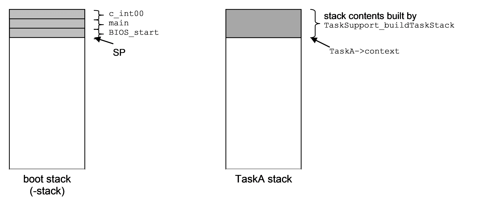
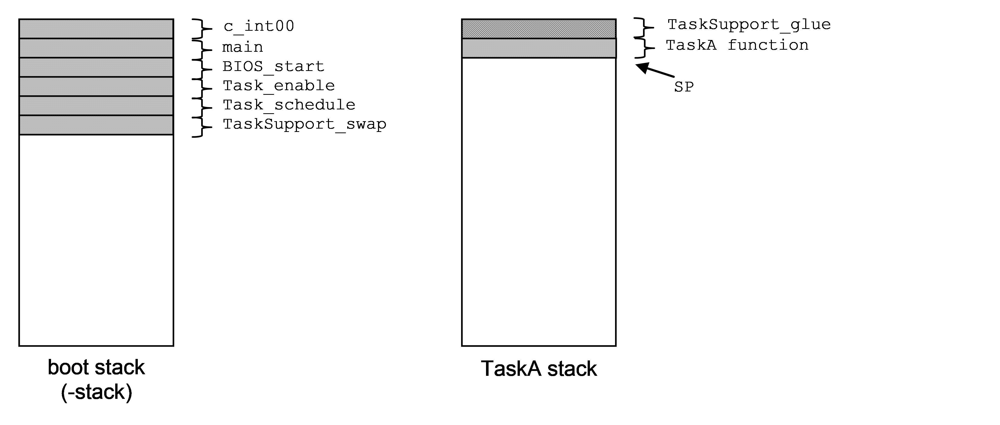
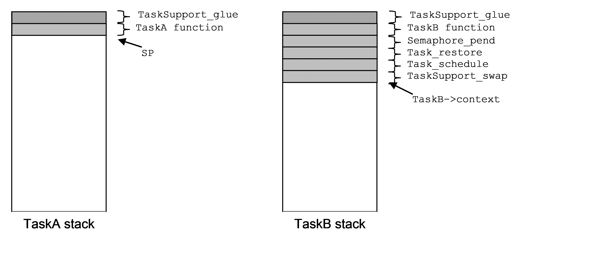
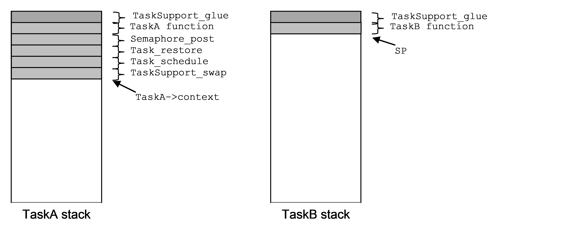
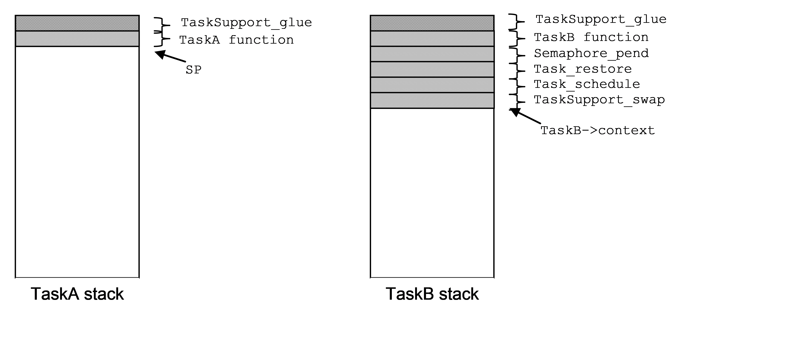
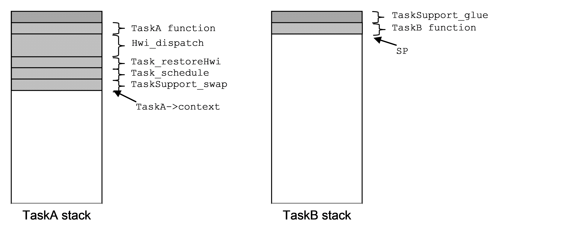
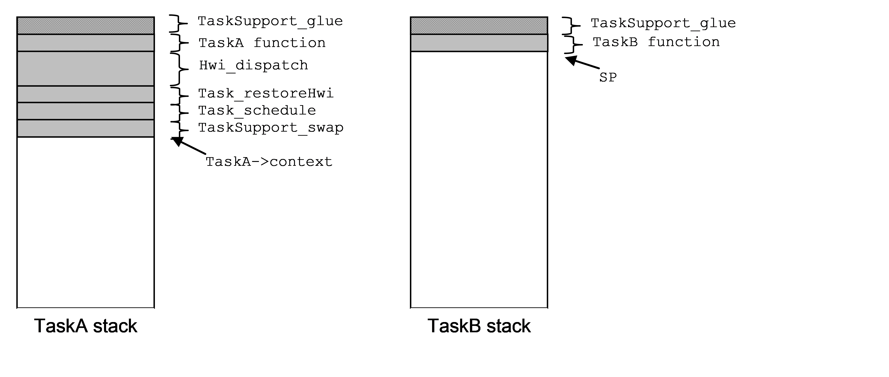
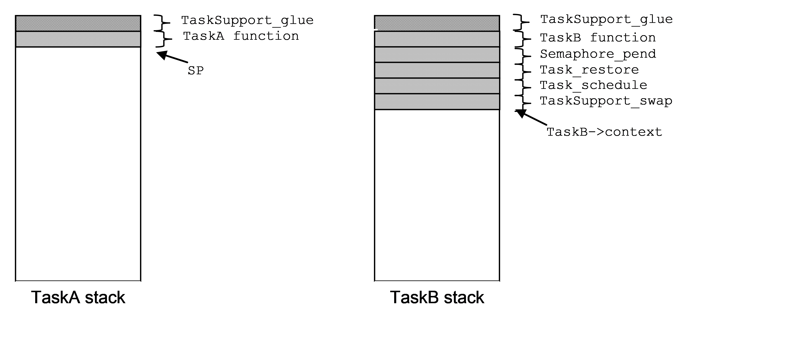
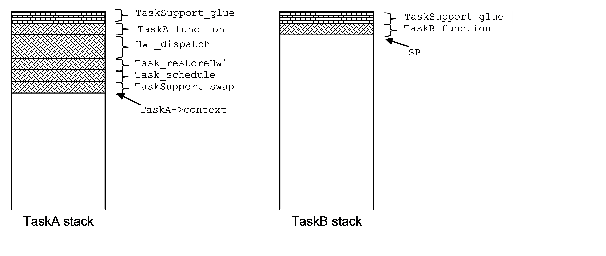
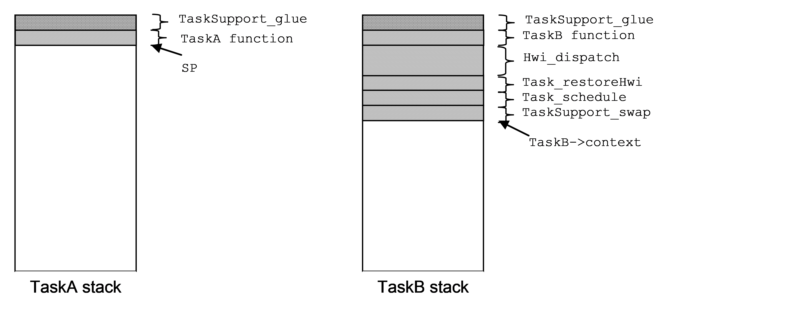

=======================
 SYS/BIOS Architecture
=======================

+----------------------+------------------------------------------------+
|**Author(s)**         |**Approval(s)**                                 |
+----------------------+------------------------------------------------+
| Alan DeMars          |                                                |
+----------------------+------------------------------------------------+

**Copyright (c) 2017-2019 Texas Instruments Incorporated.  All rights reserved.**

Information in this document is subject to change without notice.  Texas Instruments may have pending patent applications, trademarks, copyrights, or other intellectual property rights covering matter in this document.  The furnishing of this documents is given for usage with Texas Instruments products only and does not give you any license to the intellectual property that might be contained within this document.  Texas Instruments makes no implied or expressed warranties in this document and is not responsible for the products based from this document.

.. sectnum::
.. contents::
   :depth: 3

Introduction
============

Purpose & Scope
---------------

This document is intended to explain and illustrate the inner workings of the BIOS 6 scheduling kernel and other mysteries. The document focuses on the design and behavior of the non-SMP version of the BIOS 6 kernel.

Disclaimer
----------

While this document attempts to explain all the key details related to thread scheduling and other core features of BIOS, certain details are bound to be left out. For further explanation of such missing details, please refer to the source code of BIOS. Certain code contains extensive comments that explain its architecture and processing details, as well as the source code itself serving as the ultimate documentation.

Terms & Abbreviations
---------------------

+--------+------------------------------+
| Task   | A BIOS Task                  |
+--------+------------------------------+
| Swi    | A BIOS Software Interrupt.   |
+--------+------------------------------+
| Hwi    | A BIOS Hardware Interrupt.   |
+--------+------------------------------+
| SMP    | Symmetric Multi-Processing   |
+--------+------------------------------+

References
----------

Much of the text and organization of this document is derived from Rob Tivy's landmark work referenced below. As such, this work stands on the shoulders of a giant.

+------+---------------------+------------------------------------------------------------------------------------+
| #    | Title               | Author                                                                             |
+------+---------------------+------------------------------------------------------------------------------------+
| 1.   | BIOS Architecture   | Rob Tivy                                                                           |
|      |                     |                                                                                    |
|      |                     | http://wiki.sanb.design.ti.com/twiki/pub/DSPBIOS/BiosRelease6Dot00/BIOS_arch.doc   |
+------+---------------------+------------------------------------------------------------------------------------+

Thread Scheduling
=================

General
-------

There are three main types of threads in BIOS 6:

-  Task threads.

-  Software Interrupt (Swi) threads.

-  Hardware Interrupt (Hwi) threads.

Task scheduling is handled by the Task module. Swi scheduling is handled by the Swi module. Hwi scheduling is handled, for the most part, by the hardware (as configured by the user), however Hwi thread execution is carefully coordinated with Task and Swi thread execution by code within the Hwi module.

Basic Scheduling
----------------

Task, Swi, and Hwi threads are priority-based. Tasks can block, whereas Swis and Hwis are run-to-completion. Being priority-based, all thread types can be preempted by higher priority threads of that same type, while Swi threads have higher priority than Task threads, and Hwi threads have higher priority than both Swis and Tasks.

Task threads are executed on their respective task stacks. To prevent all task stacks from having to accommodate the burden of pre-empting Hwis and Swis, Hwi and Swi threads are executed on a common ISR stack.

Task Scheduling
===============

.. Requirement
   | REQ_TAG(SYSBIOS-454), REQ_TAG(SYSBIOS-455), REQ_TAG(SYSBIOS-456), REQ_TAG(SYSBIOS-463)
   | REQ_TAG(SYSBIOS-464), REQ_TAG(SYSBIOS-510), REQ_TAG(SYSBIOS-511), REQ_TAG(SYSBIOS-518)
   | REQ_TAG(SYSBIOS-570), REQ_TAG(SYSBIOS-573), REQ_TAG(SYSBIOS-575)

Task Module Object Data structure (see Task.xdc):
-------------------------------------------------

The Task Module Object (``Task_module``) contains the items necessary for the task scheduler to manage the execution of prioritized Task threads.

::

    struct Module_State {
        Bool         locked;    // Task scheduler locked flag
        Bits32       curSet;    // Bitmask reflects
                                // readyQ states
        Bool         workFlag;  // Scheduler work is pending.
                                // Optimization. Must be set
                                // whenever readyQs
                                // are modified.
        UInt         vitalTasks;// number of tasks with
                                // vitalTaskFlag = TRUE
        Handle       curTask;   // current Task instance
        Queue.Handle curQ;      // current Task's readyQ
        Queue.Object readyQ[];  // Task ready queues
        Queue.Object inactiveQ; // Task's with -1 priority
        Handle       idleTask;  // Idle Task
        Handle       constructedTasks[];  // array of statically
                                // constructed tasks
    };

Task Instance Object Data Structure (see Task.xdc):
---------------------------------------------------

The Task Instance Object (``Task_Object``) structure is used to record all information about a Task. User applications access only the Task module APIs and not the ``Task_Object`` elements directly. Functions within the Task module access elements of the ``Task_Object`` structure.

::

    struct Instance_State {
        Queue.Elem      qElem;    // task's readyQ element
        Volatile Int    priority; // Task priority
        Bits32          mask;     // curSet mask = 1 << priority
        Ptr             context;  // ptr to Task's saved context
                                  // while not in RUNNING mode.
        Mode            mode;     // READY, BLOCKED, etc
        PendElem        *pendElem;// ptr to Task, Semaphore, Event,
                                  // or GateMutexPri PendElem
        SizeT           stackSize;// Task's stack buffer size
        Char            stack[];  // buffer used for Task's stack
        IHeap.Handle    stackHeap;// Heap to allocate stack from
        FuncPtr         fxn;      // Task function
        Arg             arg0;     // Task function 1st arg
        Arg             arg1;     // Task function 2nd arg
        Ptr              env;      // Task environment pointer
        Ptr              hookEnv[];// pointer to an array of HookSet
                                   // environment pointers, one
                                   // for each hookSet
        Bool             vitalTaskFlag; // TRUE = shutdown system
                                   // if last task like this
        Queue.Handle     readyQ;   // This Task's readyQ
    };

When a Task gets switched out of the CPU, the only information that is saved in the ``Task_Object`` is the stack pointer. All other information is saved on the Task's stack, and the stack pointer is saved in ``Task_Object->context`` after all this information is saved on the stack. Part of this stack context is the C context that was created as a result of the function call nesting that brought the Task to the point of being switched out, so the return path back into the Task code is also contained on the stack. The following call return stack is typical for synchronously switched tasks while they are switched out:

-  Task_SupportProxy_swap()

-  Task_schedule()

-  Task_restore()

-  Semaphore_pend(), Semaphore_post(), Task_yield(), or Task_sleep(), etc

The Task critical region and the Task Scheduler.
------------------------------------------------

Task and Task data objects are manipulated inside a Task critical region. Upon exit from the critical region the Task scheduler is invoked to perform a Task switch if necessary as a result of actions taken within the critical region.

A Task critical region is defined by way of the ``Task_disable`` and ``Task_restore`` APIs. ``Task_disable`` is called just before the first statement of the critical region and ``Task_restore`` is called just after the last statement of the critical region. The ``Task_module.locked`` flag is used to indicate that a task critical region has been entered. Whenever ``Task_disable`` is called the lock is set and the previous value of the lock returned. ``Task_restore`` sets the lock flag to the value passed to it which should be the lock value that was returned by ``Task_disable``. If the key passed to ``Task_restore`` indicates that the scheduler is to be unlocked, ``Task_restore`` calls ``Task_schedule`` which is the Task scheduler. This design allows the nesting of ``Task_disable/restore`` calls with only the root ``Task_restore`` call actually invoking the Task scheduler.

A Task critical region may be explicitly entered from Task level processing at any time by calling ``Task_disable`` and ``Task_restore``. Hwis and Swis run within a Task critical region that is entered and exited automatically by the interrupt dispatcher and Swi scheduler.

.. note::  When Swi scheduling is disabled, Task scheduling is also disabled. This is functionally achieved by the ``Task_restore()`` code checking to see if the Swi scheduler is enabled (by calling the ``Swi_enabled()`` API) before invoking the scheduler. Upon leaving a Swi critical region, ``Swi_restore()`` also invokes the task Scheduler if it is enabled.

The following high-level operations on Tasks must be performed inside a Task critical region.

Switching Tasks
~~~~~~~~~~~~~~~

A function called ``TaskSupport_swap`` lies at the heart of a Task switch. Once all related Task housekeeping is complete, ``TaskSupport_swap`` is called to finish the Task Switch. ``TaskSupport_swap`` is responsible for saving away the current Task's context, Switching the stack pointer to the new Task, and restoring the new Task's context.

``TaskSupport_swap`` performs a context save by pushing relevant context onto the Task stack and then saving the stack pointer in the Task_Object's \'\ ``context``\ \' element. It performs a context restore by setting the stack pointer to the value saved in the new Task's Task_Object's '\ ``context``\ ' element and popping the context from the new task's stack.

The context saved/restored by ``TaskSupport_swap`` is comprised of the saved-by-child CPU registers as defined by the C usage model (registers that a function must preserve), plus certain elements that are not covered by the C usage model, such as a cache setting. The context elements that are not part of the C model are decided upon by BIOS policy - basically those things that a Task would like to have preserved for it.

``TaskSupport_swap`` performs the following actions:

-  pushes (or allocates stack frame and fills) all saved-by-child regs per the C model.

-  saves (after pushes) new SP into ``Task_Object.context``.

-  sets SP from the new Task's ``Task_Object.context`` field.

-  pops (or restores from stack frame and frees frame) all saved-by-child regs.

.. note:: The implementation of ``TaskSupport_swap`` is family specific (ie ARM Cortex V7A/M/R, MSP430, C6x, C28x, etc) and is therefore handled by a proxy module that is selected at application build time. The generic code in ``Task_schedule`` calls the family specific ``TaskSupport_swap`` function by invoking its proxy ``Task_SupportProxy_swap`` function.

Blocking Tasks
~~~~~~~~~~~~~~

A Task blocks when it needs to wait for an event, such as a semaphore becoming available or a ``Task_sleep`` timeout that causes a Task's deadline to expire. A Task is blocked with the internal Task module function ``Task_block``. The ``Task_block`` function performs the following actions:

-  removes the Task from its ready queue.

-  sets the Task's mode to ``Task_BLOCKED``.

-  if the Task's ready queue is now empty, unset its priority bit in ``Task_module.curSet``.

-  set ``Task_module.curQ`` to NULL to force rescheduling.

The code calling ``Task_block`` may (although it is not required to) also enqueue the Task somewhere, since ``Task_block`` only removes the Task from its ready queue. For semaphores, the Task will be queued on the semaphore's ``Semaphore_Object.pendQ`` structure element. The Semaphore, Task, and Event modules define a pendElem structure that contains a handle to the pending task as well as anything else the module instance needs (eg a Clock object) while the task is blocked and this element is what is placed on the respective pendQ.

Unblocking (Readying) Tasks
~~~~~~~~~~~~~~~~~~~~~~~~~~~

A Task is made ready when it is in the blocked state and the event upon which it was waiting occurs, such as a semaphore being posted or a Clock tick deadline being reached. A Task is readied with the API ``Task_unblock``. ``The Task_unblock`` API performs the following actions:

-  enqueues the Task on its ready queue.

-  sets the Task's mode to ``Task_READY``.

-  sets the Task's priority bit in ``Task_module.curSet``.

The code calling ``Task_unblock`` (ie ``Semaphore_post``, ``Event_post``) will usually dequeue the corresponding pendElem which contains a handle to the task from its own pendQ queue prior to calling ``Task_unblock``.

Running Tasks
~~~~~~~~~~~~~

By definition, there is at most one running Task in BIOS at any given time. A Task is made the running Task with the internal API ``Task_schedule``. The ``Task_schedule`` API performs the following actions related to Task scheduling:

-  From ``Task_module.curSet``, assign ``maxQ`` to the ``readyQ`` holding the highest priority task.
-  If ``maxQ`` is higher priority than ``Task_module.curQ``, schedule the new Task by performing the following actions:
        -  set ``prevTask = Task_module.curTask``.
        -  set ``Task_module.curQ = maxQ``.
        -  set ``Task_module.curTask`` to the head of ``Task_module.curQ``.
        -  perform the actual task switch with a call to the ``TaskSupport_swap`` API.

The Task scheduler (``Task_schedule``) is called in two different ways, termed synchronous and asynchronous. The synchronous way happens as a result of a Task making a call to a BIOS API that can potentially block or cause a higher priority Task to run, such as with a call to ``Semaphore_pend`` or ``Task_setPri``. The asynchronous way happens when a Hwi calls a BIOS API that readies a Task of higher priority than the currently running (and interrupted) Task.

The synchronous entry to the Task scheduler is accomplished through a call to ``Task_restore()``.

The asynchronous entry is accomplished through the ``Task_restoreHwi()`` API which is invoked within the interrupt dispatcher. This API is identical in function to ``Task_restore`` except that it leaves the precise orchestration of enabling and disabling interrupts as well as switching back to the task stack to the dispatcher so that the number and placement of nested interrupt contexts is carefully managed.

Terminating Tasks
~~~~~~~~~~~~~~~~~

Typically, Tasks don't terminate, they just run forever until the system is shut down. However, a Task can be terminated by either:

-  returning from its entry function.

-  calling ``Task_exit``.

When the last Task in the system terminates, BIOS terminates as well by calling ``System_exit(0).`` More precisely, BIOS terminates when the last Task with ``Task->vitalTaskFlag == TRUE`` terminates.

When a Task returns from its entry function, it "falls" into ``Task_exit``.

``Task_exit`` performs the following actions:

-  enter a Task critical region with a call to ``Task_disable``.

-  if this is the last Task with ``vitalTaskFlag == TRUE``, terminate the system with a call to ``System_exit(0),`` otherwise...

-  block the Task with ``Task_block.``

-  set the task's mode to ``TERMINATED.``

-  call ``Task_restore`` to leave the Task critical region and invoke the task scheduler.

Yielding Tasks
~~~~~~~~~~~~~~

A Task can yield the CPU to another Task of the same priority with a call to ``Task_yield``. ``Task_yield`` can be called by either the Task itself, or from an Hwi or Swi.

The ``Task_yield`` function performs the following actions (keep in mind that the currently running task is, by definition, at the heads of its own ``readyQ``):

-  Enter a task critical region by calling ``Task_disable().``
-  if ``Task_module.curQ`` is not ``NULL`` (``NULL`` indicates that another Task module API has been executed that is already forcing a task switch)
        -  dequeue the (currently running) Task at the head of ``Task_module.curQ``.
        -  enqueue that Task at the tail of ``Task_module.curQ``.
-  sets Task_module.curQ to NULL to force rescheduling.
-  Leave the task critical region by calling ``Task_restore()`` which will then invoke the Task scheduler if it is currently unlocked.

If there is only one Task on the ready queue then this Task is "rescheduled", becoming both the previous Task in ``prevTask`` and the current Task in ``Task_module.curTask``.

Task Startup
------------

The way a Task comes into being in BIOS is one of the more complex things to understand in the BIOS architecture. Basically, a stack frame is manually constructed (in a family specific way) by ``TaskSupport_buildTaskStack`` for the Task in a manner such as it would appear when the task gets switched out of, and the ``Task_Object.context`` structure element for that Task is set to point to the top of this constructed stack, ready to be acted on by ``TaskSupport_swap``, the function invoked within the ``Task_restore`` thread that performs the low level task context switch. As discussed above, ``TaskSupport_swap`` saves the outgoing task's saved-by-child registers on the outgoing task's stack, switches to the new task's stack, restores its saved-by-child registers and then returns (back through the ``Task_restore`` thread) into the new task thread.

The initial stack frame is different from a normal stack frame in a few ways. Here is a pseudo image of the initial C6x device task stack:

        | saved-by-child registers
        | other registers as required by BIOS task context.
        | Task_enter()
        | Task_glue()
        | arg0
        | arg1
        | User's task func()
        | Task_exit()

The first difference is in the return address from ``TaskSupport_swap``. During run-time, a Task will return from ``TaskSupport_swap`` to a point within ``Task_restore`` just after the call to ``TaskSupport_swap``, but for startup the Task returns from ``TaskSupport_swap`` to the beginning of the ``Task_enter`` function. ``Task_enter`` performs the work ordinarily done within ``Task_restore`` after the return from ``TaskSupport_swap``. One reason for this special treatment is because there is no "clean" C location that BIOS can plug into the constructed stack frame that corresponds to the return point from ``TaskSupport_swap`` within ``Task_restore``. Even if a C label were made for this location, BIOS would need to construct a stack frame in exactly the same manner that C constructs a stack frame for ``Task_restore`` (since ``Task_restore`` is written completely in C), and this would require embedding knowledge of a C stack frame that is dependent on the function definition and the compiler version.

The second difference from a normal stack is the return address from ``Task_enter``. For the manually constructed frame ``Task_enter`` will "return" to a special (family specific) glue function named ``Task_glue``. This function has full knowledge of the manually created stack frame that is present at the time it is called, and it uses this knowledge to call the Task's entry point with the appropriate function parameters. Parameters that need to appear in certain registers for the Task's function call are pulled from the stack frame and put into the appropriate registers. The Task's function itself is also pulled from the stack frame, and ``Task_glue`` proceeds to call the function's entry point.

The third difference from a normal C stack is the return address from the Task's entry function. Although a Task will typically never return from its entry function, BIOS needs to support this function's return for Tasks that do. The manually constructed stack frame is created in a way such that the Task's entry function will "return" into the beginning of ``Task_exit``. ``Task_glue`` is responsible for retrieving this "return" address from the manually constructed stack and putting it in a location appropriate for the particular DSP architecture.

Certain DSP architectures will be such that the Task's function will return back to ``Task_glue`` (if the function ever even returns), while other DSP architectures allow the Task's function to "return" directly into ``Task_exit``\ 's entry point without having to temporarily go back to ``Task_glue``.

Once inside ``Task_exit``, the Task is finally done. Its memory resources are still allocated at this point, and if they are to be freed at all, they must be freed by a separate Task. ``Task_exit`` finishes with a call to ``Task_restore``, which will schedule the next Task.

Task Switching Examples
-----------------------

Initial Task Startup (from boot thread to first task)
~~~~~~~~~~~~~~~~~~~~~~~~~~~~~~~~~~~~~~~~~~~~~~~~~~~~~

    boot stack, TaskA stack and SP prior to ``Task_enable()``

At this point the boot code (starting at ``c_int00``) has finished all the system initialization (cinit, autoinit, pinit) and then called main(), Main() has completed all the user's application initialization and then called ``BIOS_start()``. ``BIOS_start()`` has called ``Hwi_enable()`` and ``Swi_enable()``. The TaskA stack contains the stack image built by TaskSupport_buildTaskStack() as described in Task Startup.

    boot stack, task stack and SP after Task_enable()

The above diagram depicts the boot stack and TaskA's stack after the TaskA's task function has been invoked. The residual stack contents above the SP is the ``TaskSupport_glue()`` context used in case the task function returns.

The thread of execution proceeds as follows:

1. ``BIOS_start()`` calls ``Task_startup()`` which eventually calls

2. ``Task_enable()`` which will pass the execution thread to the highest priority task function which presumably begins the application. The stack pointer (SP) is pointing near the base of the boot stack defined by the linker "-stack" option. The ``Task_enable()`` thread calls the Task scheduler,

3. ``Task_schedule``. At this point, ``curTask`` is pointing to a dummy Task object which exists solely to trick the ``TaskSupport_swap`` code (which is about to be invoked for the first time) into thinking that it is switching from one task thread to another. The scheduler determines the highest priority task from ``curSet`` and sets ``curTask`` to point to its Task object.

4. ``TaskSupport_swap`` is then called with the address of the old and new task context pointers. The swap function first saves all the necessary task context on what it thinks is the current task's stack (which is actually the boot stack). Then it saves the updated SP into the current task's (the dummy task) context pointer. The new task's context pointer is retrieved and placed in the SP. The new task's register context is then "restored" and its

5. task function "returned" to (by way of the ``Task_glue`` function described in the Task Startup section above).

Only the context pointer of the dummy task object is ever used. Once it has been written to, there is no further need for the dummy task object. For this reason, the dummy task object can be a local variable within the ``Task_startup()`` thread.

Synchronous task switch to synchronously blocked Task.
~~~~~~~~~~~~~~~~~~~~~~~~~~~~~~~~~~~~~~~~~~~~~~~~~~~~~~

The above diagram depicts the task stack contents immediately before TaskA calls ``Semaphore_post()`` which will cause TaskA to block and transfer thread execution to TaskB which is currently blocked as a result of calling ``Semaphore_pend().``

The above diagram depicts immediately after TaskB resumes execution after returning from its call to ``Semaphore_pend().`` The thread of execution is as follows:

1. TaskA calls ``Semaphore_post()``

2. ``Semaphore_post()`` calls ``Task_restore()``

3. ``Task_restore()`` disables interrupts and calls ``TaskSupport_swap()`` which saves TaskA's register context and saves its SP into ``TaskA->context``, then switches the SP to ``TaskB->context``, pops its register context, then returns to

4. ``Task_restore()`` which enables interrupts and returns to

5. ``Semaphore_pend()`` which then returns to

6. TaskB's function thread.

Asynchronous switch to synchronously pended Task
~~~~~~~~~~~~~~~~~~~~~~~~~~~~~~~~~~~~~~~~~~~~~~~~

The above diagram depicts the stack contents immediately before TaskA is interrupted by a Hwi that calls ``Semaphore_post().`` TaskB is currently blocked as a result of a call to ``Semaphore_pend().``

The above diagram depicts the stack contents immediately after TaskB resumes execution after returning from its call to ``Semaphore_pend().`` The Hwi's call to ``Semaphore_post()`` causes TaskA to block and transfer the execution thread to TaskB.

The thread of execution is as follows:

1. The ``TaskA`` function thread is interrupted. This invokes

2. ``Hwi_dispatch()`` which pushes all of the saved-by-parent registers (and other interrupt related registers as needed) onto TaskA's stack, disables the Task scheduler by calling ``Task_disable()`` and then calls the ISR thread which calls ``Semaphore_post().`` As ``Semaphore_post()`` is called with the task scheduler disabled, Task switching is delayed until the dispatcher invokes

3. ``Task_restoreHwi()`` with interrupts disabled just prior to returning from the interrupt. **This version of Task_restore does not re-enable interrupts before returning**. ``Task_restoreHwi()`` then invokes the

4. ``Task_schedule(``) function which then calls

5. ``TaskSupport_swap()`` which saves TaskA's saved-by-child register context on TaskA's stack, saves the SP into ``TaskA->context``, then switches the SP to ``TaskB->context``. As we have just switched to TaskB's stack, we are now executing within TaskB's

6. ``TaskSupport_swap()`` thread which pops TaskB's saved-by-child register context, then returns to

7. ``Task_schedule()`` which then returns to

8. ``Task_restore()`` which enables interrupts and returns to

9. ``Semaphore_pend()`` which then returns to the

10. ``TaskB`` function thread.

Synchronous switch to asynchronously pended Task
~~~~~~~~~~~~~~~~~~~~~~~~~~~~~~~~~~~~~~~~~~~~~~~~

    Task stack contents before TaskB calls Semaphore_pend()

The above diagram depicts the task stack contents prior to TaskB calling ``Semaphore_pend()``. TaskA was asynchronously switched out of (ie as described in the previous example) by an interrupt that posted the Semaphore that TaskB was pended on. TaskB is about to call ``Semaphore_pend()``.

    Task stack contents after TaskA returns from the interrupt that caused it to be blocked.

The diagram above depicts the task stack contents immediately after TaskA resumes execution after returning from the asynchronous interrupt that caused it to block. The thread of execution is as follows:

1.  TaskB calls ``Semaphore_pend()``

2.  ``Semaphore_pend()`` removes TaskB from its respective ``Task_module.readyQ`` by calling Task_block() and then calls ``Task_restore()``

3.  ``Task_restore()`` **disables interrupts** and calls

4.  ``Task_schedule()`` which determines that TaskA is the highest priority ready Task, sets TaskA as the curTask, and then calls

5.  ``TaskSupport_swap()`` which saves TaskB's saved-by-child register context on TaskB's stack, saves the SP into ``TaskB->context``, then switches the SP to ``TaskB->context``. As we have just switched to TaskA's stack, we are now executing within TaskA's

6.  ``TaskSupport_swap()`` thread which pops TaskA's saved-by-child register context, then returns to

7.  ``Task_schedule()`` which then returns to

8.  ``Task_restoreHwi()``. **Remember,** **this version of Task_restore does not re-enable interrupts before returning** to

9.  ``Hwi_dispatch()``, and is used here specifically to insure that the dispatcher completely restores TaskA's context before interrupts are re-enabled. This prevents nested interrupts from growing on a task's stack. Re-enabling of interrupts is performed by the target specific return-from-interrupt instruction at the end of the dispatcher function which also returns execution to

10. TaskA's function thread.

Asynchronous switch to asynchronously pended Task
~~~~~~~~~~~~~~~~~~~~~~~~~~~~~~~~~~~~~~~~~~~~~~~~~

The above diagram depicts the task stack contents prior to TaskB being interrupted by a Hwi that calls ``Task_setPri()`` that results in TaskA's priority becoming higher than TaskB. TaskA had previously been asynchronously switched out of by an interrupt that posted the Semaphore that TaskB was pended on. TaskB is executing within its task function and is about to be interrupted.

The diagram above depicts the task stack contents immediately after TaskA resumes execution after returning from the asynchronous interrupt that caused it to block. The thread of execution is as follows:

1.  The ``TaskB`` function thread is interrupted. This invokes

2.  ``Hwi_dispatch()`` which pushes all of the saved-by-parent registers (and other interrupt related registers as needed) onto TaskB's stack, disables the Task scheduler by calling ``Task_disable()`` and then calls the ISR thread which calls ``Task_setPri()`` which makes TaskA's priority higher than TaskB. As ``Task_setPri()`` is called with the task scheduler disabled, Task switching is delayed until the dispatcher invokes

3.  ``Task_restoreHwi()`` with interrupts disabled just prior to returning from the interrupt. **This version of Task_restore does not re-enable interrupts before returning**. ``Task_restoreHwi()`` then invokes the

4.  ``Task_schedule()`` which determines that TaskA is the highest priority ready Task, sets TaskA as the curTask, and then calls

5.  ``TaskSupport_swap()`` which saves TaskB's saved-by-child register context on TaskB's stack, saves the SP into ``TaskB->context``, then switches the SP to ``TaskB->context``. As we have just switched to TaskA's stack, we are now executing within TaskA's

6.  ``TaskSupport_swap()`` thread which pops TaskA's saved-by-child register context, then returns to

7.  ``Task_schedule()`` which then returns to

8.  ``Task_restoreHwi().`` **Remember,** **this version of** ``Task_restore`` **does not re-enable interrupts before returning** to

9.  ``Hwi_dispatch(),`` and is used here specifically to insure that the dispatcher completely restores TaskA's context before interrupts are re-enabled. This prevents nested interrupts from growing on a task's stack. Re-enabling of interrupts is performed by the target specific return-from-interrupt instruction at the end of the dispatcher function which also returns execution to

10. TaskA's function thread.

Task Scheduling Variables
-------------------------

Module variables:
~~~~~~~~~~~~~~~~~

**Bool Task_module.locked** - This variable controls entry into the Task scheduler. A value of FALSE (0) indicates the Task scheduler is open; TRUE indicates the Task scheduler is locked and scheduling should not be performed at that time. The Task module APIs ``Task_disable`` and ``Task_restore`` are used by applications as well as within BIOS to precisely schedule the servicing of the Task module readyQs described below. The Hwi dispatcher will disable Task scheduling upon entry and restore Task scheduling after the Hwi thread has been called. Only the bottom-most interrupt (the one that fired first in a chain of nested interrupts) will invoke the Task scheduler. If an Hwi interrupts while the Task scheduler is locked, no Task scheduling will be performed by the Hwi module (since the bottom-most interrupt's ``Task_restore`` call would not result in ``Task_module.locked`` being restored to FALSE.

**Bits32 Task_module.curSet** - This variable is a bitmask that represents the priority queues that contain ready Tasks. If a priority queue contains at least one Task then the bit representing that queue will be set. A bit within ``Task_module.curSet`` is set to 1 when a Task becomes ready to run.

**Bool Task_module.workFlag** - This variable indicates that Task scheduler processing is required. It is set to true by any function that modifies the state of the readyQs and is set to false by the Task scheduler upon re-evaluation of the priorities of the currently ready Tasks.

**UInt Task_module.vitalTasks** - The .number of non-terminated tasks that have their ``vitalTaskFlag`` set to true. If this number reaches zero by way of the termination of the last task with its ``vitalTaskFlag`` true, ``System_abort()`` is called.

**Task_Handle Task_module.curTask** - This variable points to the currently running task's Task object. It is set by the Task Scheduler when switching to a new Task, using the following assignment in the Task Scheduler:

``Task_module->curTask = (Task_Object *)Queue_head(maxQ);``

(Where maxQ is the readyQ corresponding to the most significant bit set in curSet). It is used by many BIOS APIs to perform work on the current Task.

**Queue_Object \*Task_module.curQ** - This variable points to the ``Task_module.readyQ`` array element that corresponds to the currently running Task in ``Task_curTask``. It represents the highest priority level containing a ready Task. It is used in the Task Scheduler to decide if a new Task should be scheduled, and is also used in various places in the kernel to reference the queue associated with the currently running Task. It can be set to NULL to force the Task module to schedule a new Task.

**Queue_Object Task_module.readyQ[]** - This variable is a pointer to an array of ``Queue_Objects`` that are used to hold Tasks. The readyQ elements are used for the priority queues that hold ready Tasks. The priority queues are FIFO ordered. Within a priority queue, the first Task on the list will be the next one to run when that priority level becomes the highest level with a ready Task.

**Queue_Object Task_module.inactiveQ** - This variable is the head of the queue of Tasks in the inactive (priority = -1) state.

**Task_Handle Task_module.idleTask** - This is the idle Task's task object.

**Task_Handle constructedTasks** - This is a pointer to an array of handles to all tasks that were statically constructed by means of the ``Task.construct()`` meta function. These are Task objects embedded in other static application objects. These Task objects need to have their initialization completed by ``Task_postInit`` at runtime like the statically created tasks (i.e., tasks created using the ``Task.create()`` meta function).

Swi Scheduling
==============

Swi Module Object Data structure (see Swi.xdc):
-----------------------------------------------

The Swi Module Object (``Swi_module``) contains the items necessary for the Swi scheduler to manage the execution of prioritized Swi threads.

::

    struct Module__Object {
        Bool          locked;  // Swi scheduler locked flag
        Bits32        curSet;  // Bitmask reflects
                               // readyQ status
        UInt          curTrigger;// current Swi's
                               // on-entry trigger value
        Handle       curSwi;   // current Swi
        Queue.Handle curQ;     // current Swi's readyQ
        Queue.Object readyQ[]; // Swi ready queues
        Handle       constructedSwis;// array of statically
                               // constructed Swis
    };

Swi Instance Object Data Structure (see Swi.xdc):
-------------------------------------------------

The Swi Instance Object (``Swi_Object``) structure is used to record all information about a Swi. User applications access only the Swi module APIs and not the ``Swi_Object`` elements directly. Functions within the Swi module access elements of the ``Swi_Object`` structure.

::

    struct Instance__Object {
        Queue.Elem    qElem;   // Link within readyQ
        FuncPtr       fxn;     // Swi function
        Arg           arg0;    // Swi function 1st arg
        Arg           arg1;    // Swi function 2nd arg
        UInt          priority;// Swi priority
        Bits32        mask;    // curSet mask =
                               // 1 << priority
        Bool          posted;  // TRUE = Swi already posted.
        UInt          initTrigger;// Initial Trigger value
        UInt          trigger; // Swi Trigger
        Queue.Handle  readyQ;  // This Swi's readyQ
        Ptr           hookEnv[]// pointer to an array of HookSet
                               // environment pointers, one
                               // for each hookSet
    };

The Swi critical region and the Swi Scheduler.
----------------------------------------------

Swis and Swi data objects are manipulated inside a Swi critical region. Upon exit from the critical region the Swi scheduler is invoked to perform a Swi switch if necessary as a result of actions taken within the critical region.

A Swi critical region is defined by way of the ``Swi_disable`` and ``Swi_restore`` APIs. ``Swi_disable`` is called just before the first statement of the critical region and ``Swi_restore`` is called just after the last statement of the critical region. The ``Swi_module.locked`` flag is used to indicate that a Swi critical region has been entered. Whenever ``Swi_disable`` is called the lock is set and the previous value of the lock returned. ``Swi_restore`` sets the lock flag to the value passed to it which should be the lock value that was returned by ``Swi_disable``. If the key passed to ``Swi_restore`` indicates that the scheduler is now unlocked, ``Swi_restore`` calls ``Swi:scheduler`` which is the Swi scheduler. This design allows the nesting of ``Swi_disable/restore`` calls with only the root ``Swi_restore`` call actually invoking the Swi scheduler.

A Swi critical region may be explicitly entered from Task or Swi level processing at any time by calling ``Swi_disable`` and ``Swi_restore``. Hwis run within a Swi critical region that is entered and exited automatically by the interrupt dispatcher.

.. note:: When Swi scheduling is disabled, Task scheduling is also disabled. This is functionally achieved by the ``Task_restore()`` code checking to see if the Swi scheduler is enabled (by calling the ``Swi_enabled()`` API) before invoking the scheduler. Upon leaving a Swi critical region, ``Swi_restore()`` also invokes the task Scheduler if it is enabled.

Posting Swis
------------

There are quite a few ways that a Swi can become ready to run. The most primitive of these ways is with a call to the API ``Swi_post``, which will always post the Swi. A Swi can also become posted with operations such as ``Swi_andn``, where multiple Swi operations are needed before the Swi becomes ready to run. For the purpose of this discussion, a Swi has been "posted" when it becomes ready to run by any of these possible methods.

For the various ways that a Swi can become posted, they all boil down to a call to ``Swi_post``. In order to ready a Swi, ``Swi_post`` performs the following actions:

-  Disable interrupts

-  set ``Swi_Object.posted`` to TRUE.

-  if ``Swi.posted`` was already TRUE, it is already posted so restore interrupts and return.

-  Enter Swi critical region by calling Swi_disable()

-  enqueue Swi at end of ``Swi_module.readyQ[Swi.priority]``

-  set Swi's priority bit in ``Swi_module.curSet``.

-  Restore interrupts.

-  Exit Swi critical region by calling Swi_restore which will invoke the Swi scheduler if it is unlocked.

Only when ``Swi_post`` is called from a thread context whose priority is lower than the Swi being posted (and the Swi scheduler is unlocked) will the Swi run in that execution thread. Otherwise it is simply placed in its corresponding ``readyQ`` to be run later when the current Swi thread priority dips below the posted Swi's priority.

Since, by definition, no Swi threads are active within the execution of a Task thread, if ``Swi_post`` is called from a Task thread, it will run when ``Swi_post`` calls ``Swi_restore`` (as long as the Swi scheduler hasn't been locked by some previous ``Swi_disable`` call).

When ``Swi_post`` is called from a Hwi thread, the Hwi module has already locked the Swi scheduler, thereby taking responsibility for scheduling any Swis.

Scheduling (or running) Swis
----------------------------

A Swi will run when it becomes the highest priority posted Swi and the Swi scheduler is unlocked. Per the Swi dynamic model, multiple posts of a Swi will result in only a single invocation. That behavior is managed by way of the ``posted`` variable in the ``Swi_Object``.

Scheduling a Swi involves two operations. First, ``Swi_module.locked`` must be checked. Only when it is FALSE (unlocked) will Swi scheduling occur.

Second, it must be determined whether the Swi being posted is of higher priority than the Swi thread currently executing (if any). The priority of any currently executing Swi is defined by the address of the readyQ it came from. This address is maintained in ``Swi_module.curQ`` and is updated anytime a Swi runs to point to that Swi's ``readyQ,`` and restored to its previous value when the Swi thread completes (see Swi.c:Swi_run). The decision is made by comparing the address of the highest priority non-empty ``readyQ`` with the address of the currently executing Swi thread's ``readyQ``. The highest priority non-empty ``readyQ`` index is defined as the highest order bit set in ``Swi_module.curSet``. As mentioned above in the ``Swi_post`` description, ``Swi_module.curSet`` is updated with each posted Swi to include that Swi's ``readyQ`` index bit. If a newly posted Swi's ``readyQ`` address is higher than the current value in ``Swi_module.curQ``, then the newly posted Swi is executed.

The steps needed to be performed by the Swi scheduler are the following:

-  Enter Task critical region by calling ``Task_disable()``. This step insures that no Task switching will result from any Task priority-effecting APIs called within a Swi thread.

-  Disable interrupts.

-  Determine the highest priority non-empty ``readyQ`` by finding the bit number of the highest order bit set in ``Swi_module.curSet`` and using this number as the index into the array of Swi ``readyQ``\s.

-  Compare this ``readyQ`` address with the current ``readyQ`` address (contained in ``Swi_module.curQ``) and if less than or equal to it (ie the currently running Swi is of equal or higher priority than the highest priority ready Swi), simply unlock the scheduler and return. Else,

-  Switch to the ISR stack if not already on it.

-  Run all Swi's at priority level higher than the current Swi priority by calling ``Swi_runLoop().``

-  Switch back to the Task stack if we switched from it above.

-  Re-enable interrupts.

-  Leave Task critical region by calling ``Task_restore``.

-  This step may result in a task switch if a higher priority task than the one currently executing became ready as a result of operations performed by the Swis invoked above.

An optimized version of the above procedure is utilized by the Hwi dispatcher which eliminates:

-  entering and exiting the Task critical region,

-  disabling and enabling interrupts, and

-  switching to and from the ISR stack

These functions are already performed by the dispatcher.

Swi Scheduling functions
------------------------

``Void Swi_runLoop()`` - This function is called by the Swi scheduler after switching to the ISR stack once it has determined that a Swi is ready to run that is of higher priority than any currently running Swi. Starting with the highest priority ready Swi and working its way down to the current Swi priority, the Swis are removed from their respective readyQ and passed to ``Swi_run()`` to execute.

Switching to the ISR stack is accomplished by means of passing the address of ``Swi_runloop`` to a carefully crafted assembly function that switches the current stack pointer to point to the base of the ISR stack if the current thread isn't already being executed on the ISR stack. It then calls ``Swi_runloop`` and then returns the stack pointer to its original value if the switch to the ISR stack was required upon entry.

``Void Swi_run(Swi_Object *swi)`` - This function performs the following actions:

-  Save previous ``Swi_module.curQ, Swi_module.curMbox``, ``Swi_module.curSwi`` values.

-  Set ``Swi_module.curQ`` to **swi's** ``readyQ``.

-  Set ``Swi_module.curTrigger`` to **swi's** ``trigger``.

-  Set ``Swi_module.curSwi`` to **swi**.

-  Set **swi**\ 's trigger to **swi's** ``initTrigger``.

-  Unlock the Swi Scheduler (``Swi_module.locked = FALSE``).

-  Enable global interrupts.

-  Call **swi's** function, passing **swi's** arg0 and arg1 parameters.

-  Disable global interrupts.

-  Lock the Swi scheduler (``Swi_module.locked = TRUE``)

-  Restore ``Swi_module.curQ, Swi_module.curTrigger, Swi_module.curSwi``.

Swi Scheduling Variables
------------------------

Module variables:
~~~~~~~~~~~~~~~~~

**Bool Swi_module.locked** - This variable controls entry into the Swi scheduler. A value of FALSE indicates the Swi scheduler is open; TRUE indicates the Swi scheduler is locked and scheduling should not be performed at that time. The Swi module APIs Swi_disable and Swi_restore are used by applications as well as within BIOS to precisely schedule the execution of posted Swis. The Hwi dispatcher will disable Swi scheduling upon entry and restore Swi scheduling after the Hwi thread has been called. Only the bottom-most interrupt (the one that fired first in a chain of nested interrupts) will invoke the Swi scheduler. If an Hwi interrupts while the Swi scheduler is locked, no Swi scheduling will be performed by the Hwi module (since the bottom-most interrupt's Swi_restore call would not result in ``Swi_module.locked`` being restored to FALSE.

As a conceptual aid, ``Swi_module.locked`` can be considered to be a flag that you grab in order to gain control of Swi scheduling. You first need to check if any other thread currently holds the flag, and if none, you claim the scheduling flag by setting it to something other than 0, thus indicating to other threads "I will perform any potential Swi scheduling, so you shouldn't do any scheduling.". This operation must be of an atomic test-and-set nature (i.e., interrupts disabled).

**Bits32 Swi_module.curSet** - This variable is a bitmask that represents the priority levels of all Swis that are posted. A bit is set when a Swi becomes posted, and its priority bitmask (``1 << Swi.priority``) is ORed into this bitmask. A bit is cleared when there are no more Swis of that bit's priority posted. It is read by Swi scheduling code to determine whether a Swi that is currently running should be preempted by a higher-priority Swi; if ``Swi_module.curSet`` indicates that a Swi of higher priority than any currently executing Swi has been posted, the Swi scheduler will pre-empt the currently running Swi and schedule (i.e, run) a new Swi. Upon completing the execution of all Swi's of higher priority, the pre-empted Swi is returned to.

**Queue_Object Swi_module.readyQ[numPriorities]** - This variable is an array of Queue objects (in Swi priority order) that are used to hold posted Swis. When a Swi becomes posted, it is linked to the tail of its respective ready (priority) queue.

**Swi_Object \*Swi_module.curSwi** - This variable points to the currently running Swi object.

**Queue_Object \*Swi_module.curQ** - This variable points to the currently running Swi 's ready Q element.

**UInt Swi_module.curMbox** - This variable is a copy of the current Swi's mailbox upon entry to that Swi. It is set by ``Swi_run`` to the value of the Swi's mailbox element. Before setting it, the current value is pushed on the stack, and after running the Swi the old value is popped off the stack. It is read by the ``Swi_getmbox`` API.

Hwi Processing
==============

.. Requirement
   | REQ_TAG(SYSBIOS-543), REQ_TAG(SYSBIOS-544), REQ_TAG(SYSBIOS-545), REQ_TAG(SYSBIOS-546)
   | REQ_TAG(SYSBIOS-547), REQ_TAG(SYSBIOS-552), REQ_TAG(SYSBIOS-1006), REQ_TAG(SYSBIOS-1007)
   | REQ_TAG(SYSBIOS-1008)

This section is titled "Hwi Processing" as opposed to "Hwi Scheduling" because BIOS doesn't handle scheduling of Hwis in the same sense that it schedules Tasks and Swis. Hwis are scheduled by the hardware under control of the device's interrupt processing. BIOS will affect this scheduling by plugging interrupt vectors and masking particular interrupts, as well as masking interrupts globally during times that BIOS is not in a position to take an interrupt.

TI DSP Hwis typically don't have priorities in the same sense as Tasks and Swis. A Hwi's logical priority is controlled by interrupt masking by manipulation of IER register bits as specified by the user application. This logical priority is not associated with an interrupt's hardware priority as specified in a DSP's data book - on TI DSPs the hardware priority comes into play only when deciding which of multiple interrupts to service when more than one is ready on a given CPU cycle.

ARM CPU Hwi priorities and nesting behavior are managed entirely by the prioritized interrupt controller onboard the device. The various ARM Hwi modules provide APIs to allow configuration of each Hwi's priority.

The main functionality in Hwi processing involves three things:

-  save and restore the CPU state for the interrupted thread.

-  setup the CPU state for the Hwi function.

-  perform Swi and Task scheduling after running the Hwi function.

In order to preserve the layering of Task/Swi/Hwi priorities, only the bottom most Hwi in a stack of nested Hwis should perform Swi and Task scheduling, and only when that bottom most Hwi occurs (interrupts) while the Swi and Task schedulers are unlocked. This model is achieved by having the Hwi module invoke the Task and Swi critical regions' enter an exit functions ``Task_disable``, ``Task_restore``, ``Swi_disable``, and ``Swi_restore``.

One of the most important aspects of the hardware interrupt processing is disabling interrupts globally upon servicing an interrupt. The Hwi module does, in fact, allow for Hwi nesting, but there are key operations that must be performed by the Hwi module before interrupts can be opened up again after being disabled by the hardware.

On the other side of Hwi processing it works the other way around - at some point in leaving Hwi processing, interrupts must be globally disabled and not enabled again until precisely when execution has returned back to the code that was interrupted. As with entering a Hwi, there are key operations that must be performed between disabling interrupts and exiting the Hwi processing.

ISR stack handling
------------------

BIOS runs all Hwi threads on a common ISR stack. Only a single stack is needed since these threads are "run-to-completion". The Hwi interrupt dispatcher switches to and from the ISR stack in order to run the Hwi threads.

As Hwi threads are pre-emptible, the lowest order Hwi thread is responsible for making the switch to and from the ISR stack.

Management of the switch to and from the ISR stack is handled by carefully crafted assembly code within the architecture/device dependent Hwi prologue and Hwi epilogue code.

The Hwi Dispatcher
------------------

Interrupts that are managed by BIOS are all routed through a common function generically referred to as the "Hwi Dispatcher". For each device supported by BIOS, a device specific Hwi dispatcher is provided which handles the unique requirements of the device's underlying interrupt hardware. The Hwi dispatcher is logically divided into two pieces: the "Hwi Prologue", which performs those actions required to properly prepare for calling a user's ISR function, and, the "Hwi Epilogue", which unwinds from the user's ISR function and forces adherence to the thread scheduling priority requirements of BIOS. The Hwi dispatcher orchestrates the execution of Swis posted by ISRs and afterward invokes the Task scheduler prior to returning from the lowest order interrupt.

Hwi Prologue
------------

The Hwi module must perform the following actions upon entering an ISR before enabling interrupts:

-  Save all saved-by-parent registers as defined by the C runtime model.
-  Save DP, CSR, IRP registers
-  Switch to the ISR stack if not already on it.
-  Disable Swi Scheduler
-  Disable Task Scheduler
-  Save interrupt enable register and mask specified interrupts. This step applies to all C28, C6X, ARP32, devices. The Hwi dispatchers for ARM devices do not perform this step. The native priority based pre-emption behavior of the various supported Arm devices is untampered with.
-  Enable global interrupts

These actions are **required** to be done before enabling interrupts to ensure that at most two interrupt contexts are saved on a task stack.

Hwi Epilogue
------------

After calling the user's Hwi function, the Hwi module must perform the following actions:

-  Disable global interrupts
-  Restore the interrupt enable register according to the Hwi masking parameter. As mentioned in the **Hwi Prologue** discussion, this step does not apply to ARM devices.
-  Restore Swi Scheduling
        -  If Swi scheduling becomes enabled (ie If this is the bottom most interrupt and Swi's were enabled upon entry to this interrupt), any Swi's posted within this Hwi that are of a higher priority than any currently running Swi will be run at this time (with interrupts enabled). On return, interrupts will be disabled.
-  Switch back to Task stack if the ISR stack is now empty (meaning we Switched **to** the ISR stack in the Hwi prologue).
-  Restore Task Scheduling
        -  If Task scheduling becomes enabled and a Task switch needs to be performed as a result of any operation within the user's Hwi or Swi functions, the switch will occur at this time. Otherwise,
-  restore interrupt return pointer (C6x only, restores IRP).
-  restore pre-interrupt CSR
-  restore any math status bits that were saved in the Hwi prologue.
-  restore all saved-by-parent registers.
-  Return to the interrupted thread (and enable global interrupts).

Hwi Variables
-------------

There is only one variable that is handled by the Hwi module; Hwi_module.taskSP.

**Ptr Hwi_module.taskSP** - This variable is used to hold the value of a Task's stack pointer when processing an interrupt (or Swi). The BIOS architecture contains a dedicated interrupt stack that is used for processing all Hwi and Swi threads, so when those schedulers are invoked they will transition to the ISR stack if it's not already in use. To perform the transition to the interrupt stack, the current stack pointer (which will point to a Task stack) is first saved in ``Hwi_module.taskSP`` and the SP is moved to point to the beginning of the ISR stack. For ARM Cortex V7M devices, the native behavior of the device to auto-switch to an ISR stack when an interrupt occurs is utilized, thus eliminating the need for a variable to save the interrupted task's SP.

Idle Threads
============

.. Requirement
   | REQ_TAG(SYSBIOS-514), REQ_TAG(SYSBIOS-515), REQ_TAG(SYSBIOS-516), REQ_TAG(SYSBIOS-517)

Idle threads are user-specified functions that are called within the context of a dedicated Idle task which is running at the lowest and reserved task priority level of zero. These functions are called within an infinite loop with interrupts enabled in order to facilitate thread preemption. The Idle Task (the Task Object, the Task stack, and the Task function) is auto generated by the application configuration process. As the Idle task owns the lowest task priority level, the Idle functions are only executed when all other tasks are either blocked or not ready to run.

In addition to the set of functions the Idle task will execute, the user can specify the Idle task's stack size, and the name of the linker section the Idle task's stack is placed in.

Eliminating the Idle task
--------------------------

For systems with limited RAM resources an option is provided to run the Idle functions within the context of the last task to block when all other tasks are blocked. As it is likely difficult to control the order in which tasks block in a dynamic system, all task stacks must be sized to accommodate the stack depth required to sequentially invoke all of the configured Idle functions including the stack requirements of the thread that invoked the blocking API that resulted in the Idle function loop invocation. This RAM burden is usually minor in comparison to the size of stack required for a dedicated task as each task stack is required to support up to two interrupt contexts.

Semaphores, Events, & Mailboxes
===============================

.. Requirement
   | REQ_TAG(SYSBIOS-500), REQ_TAG(SYSBIOS-501), REQ_TAG(SYSBIOS-502), REQ_TAG(SYSBIOS-503)
   | REQ_TAG(SYSBIOS-504), REQ_TAG(SYSBIOS-508)

The blocking APIs within the Semaphore, Event, Mailbox, and other modules are all designed and implemented in a similar way in order to achieve the desired task priority based blocking behavior.

As described in detail in the `Synchronous Task Switching <#synchronous-switch-to-asynchronously-pended-task>`__ section above, a task is blocked with the following code sequence:

::

    /* disable the task scheduler and save the current task lock key */
    key = Task_disable();

    /* remove 'tsk' from its corresponding ready list */
    Task_block(tsk);

    /* enable and run the task scheduler to continue execution on the highest priority task that is ready to run */
    Task_restore(key);

    /* The blocking API execution resumes here when the task is unblocked */

Additionally, in order to allow a task to be deleted while in the blocked state, a blocking API is required to initialize the pendElem field within the task's Task_Object if the task must be removed from a pendQ it is placed in while in the blocked state. More details regarding the structure and use of pendElem elements can be found by studying the code in Task.c

Clock
=====

.. Requirement
   | REQ_TAG(SYSBIOS-519), REQ_TAG(SYSBIOS-520), REQ_TAG(SYSBIOS-521), REQ_TAG(SYSBIOS-522)
   | REQ_TAG(SYSBIOS-523), REQ_TAG(SYSBIOS-525), REQ_TAG(SYSBIOS-531)
   | REQ_TAG(SYSBIOS-1042)

The Clock Module provides periodic and one-shot timing services in BIOS. It generates the periodic system tick which is used by any BIOS APIs which block with a timeout value. The system tick period is specified in microseconds and is a config parameter to Clock. By default, this parameter (Clock.tickPeriod) is set to 1000us. To generate the system tick, Clock requires the use of a device specific hardware timer. Since timers are very different depending on target/platform Clock uses an ITimer proxy to configure and control the hardware timer. The Timer delegate module is determined at application build time by meta code that uses the device type and platform to attach an appropriate Timer module to the Clock module.

Clock allows clients to create one-shot and periodic clock events. The Semaphore, Event, Mailbox and Task Modules use Clock to request one-shot events for ``Semaphore_pend()``, ``Event_pend()``, ``Mailbox_pend()``, ``Mailbox_post(),`` and ``Task_sleep()``.

Clock scheduling
-----------------

Clock maintains a queue of Clock Objects to service all the Clock timeout events. This queue is unsorted. Clock objects are added to the Clock queue when created and removed from the Clock queue when they are deleted. A flag within the Clock object indicates whether it is currently active or not. The Clock Object contains the timeout value, expressed in Clock.tickPeriod units, as well as a Clock tick value that is computed when the Clock object is started based on the current system Clock tick count and the timeout value of the Clock object. Additionally, the Clock object contains a callback function that is invoked when the timeout is reached.

The Clock queue is serviced as necessary (either periodically or dynamically based on the nearest Clock object timeout value) to affect the timeouts specified in the active Clock objects within the Clock queue. The servicing is performed within the context of a Swi that is posted by a timer interrupt provided by the configured Clock Timer delegate.

The Clock Swi function walks the Clock queue looking for active Clock objects whose scheduled tick count matches the current tick count and invokes the corresponding callback function if so. If the Clock object is configured to be periodic, a new timeout value is computed and saved, otherwise (ie it is a one-shot event) the Clock object is marked inactive.

Clock Startup
-------------

The timer that drives the Clock module is configured statically and started within the ``BIOS_start()`` function call prior to any task threads being started.

Clock Module Object, Params and Functions
-----------------------------------------

**Object:**

::

        struct Module__Object {
            Queue.Object    oneshotQ;   //oneshot queue
            Queue.Object    periodicQ;  //periodic queue
            UInt32          systemTime; //system time since startup
            Swi.Object      swi;        //swi used to process queue
        };

**Params:**

::

    proxy TimerProxy inherits ti.sysbios.interfaces.ITimer;
    metaonly config UInt swiPriority = (Swi.numPriorities - 1);
    config UInt32 tickPeriod;

**Functions:**

::

    UInt32 Clock_getTickPeriod()
    UInt32 Clock_getTicks()
    Void Clock_tickStop()
    Bool Clock_reconfig()
    Void Clock_tickStart()

Clock Instance Object and Functions
-----------------------------------

**Object:**

::

        struct Instance_State {
            Queue.Elem  elem;       //required for Clock queue
            UInt32      timeout;    //in Clock ticks
            UInt32      currTimeout;// working timeout
            UInt32      period;     //periodic event if > 0
            Volatile Bool  active;  //active/idle flag
            FuncPtr     fxn;        //event function
            UArg        arg;        //function arg
        };

**Params:**

::

    config Bool startFlag = false;
    config UInt period = 0;
    config UArg arg = null;

**Functions:**

::

    Clock_create(Clock_FuncPtr fxn, UInt timeout);
    Void setPeriod(UInt period);
    Void setTimeout(UInt timeout);
    Void setFunc(FuncPtr fxn, UArg arg);
    UInt32 getTimeout();
    Uint32 getPeriod();

The HAL Timer Module
====================

.. Requirement
   | REQ_TAG(SYSBIOS-1020), REQ_TAG(SYSBIOS-1021), REQ_TAG(SYSBIOS-1022), REQ_TAG(SYSBIOS-1023)
   | REQ_TAG(SYSBIOS-1024), REQ_TAG(SYSBIOS-1025), REQ_TAG(SYSBIOS-1026), REQ_TAG(SYSBIOS-1027)
   | REQ_TAG(SYSBIOS-1028), REQ_TAG(SYSBIOS-1029), REQ_TAG(SYSBIOS-1030), REQ_TAG(SYSBIOS-1031)
   | REQ_TAG(SYSBIOS-1032), REQ_TAG(SYSBIOS-1033), REQ_TAG(SYSBIOS-1034), REQ_TAG(SYSBIOS-1035)
   | REQ_TAG(SYSBIOS-1036), REQ_TAG(SYSBIOS-1037), REQ_TAG(SYSBIOS-1038), REQ_TAG(SYSBIOS-1039)
   | REQ_TAG(SYSBIOS-1041)

Similar to the Clock module, the HAL Timer module provides periodic and one-shot timer interrupt services. These timer services are independent of the Clock module and can be configured with any period or one-shot timeout value without affecting the behavior of Clock objects whose timeouts are all multiples of the common ``Clock.tickPeriod``. Specifically, blocking APIs with timeouts such as ``Semaphore_pend()``, ``Task_sleep()`` are not affected by the timer services provided by the HAL Timer module.

The HAL Timer module is a proxy for a family/device specific Timer delegate module that provides the APIs as defined in the ti.sysbios.interfaces.ITimer interface module. The device/family specific Timer Module is determined at application build time by meta code that uses device and platform information to determine which Timer delegate to attach to the HAL Timer proxy module. The default Timer delegate assignment can be overridden by the user if desired.

Unlike the Clock module, the HAL Timer module's periodic or one-shot application timeout callback is called within the context of a Hwi. The HAL Timer module provides more flexibility in specifying the timeout that can be configured.

BIOS Module
===========

BIOS System Startup
-------------------

The BIOS startup sequence is logically divided into two phases: those operations that occur prior to the application's "main()" function being called, and those operations that are performed after the application's "main()" function is invoked.

The "before main()" startup sequence is governed completely by the RTSC runtime package\*.

The "after main()" startup sequence is governed by BIOS and is initiated by an explicit call to the BIOS_start() function at the end of the application's main() function.

Control points are provided at various places in each of the two startup sequences for user startup operations to be inserted.

The RTSC runtime startup sequence is as follows:

1) Immediately after CPU reset, perform target-specific CPU initialization (beginning at c_int00).

2) Prior to cinit(), run the single user-supplied "reset function" (see Startup.resetFxn).

3) Run cinit() to initialize C runtime environment.

4) Run the user-supplied "first functions" (See Startup.firstFxns).

5) Run all the module initialization functions.

6) Run pinit().

7) Run the user-supplied "last functions" (See Startup.lastFxns).

8) Run main().

The BIOS startup sequence begins at the end of main() when BIOS_start() is called:

1) Run the user-supplied "startup functions" (see BIOS.startupFxns). This is also when all statically configured timers are initialized per their user-configuration. If a timer was configured to start "automatically", it is started here.

2) Enable Hardware Interrupts.

3) Enable Software Interrupts. If the system supports Software Interrupts (Swis) (see BIOS.swiEnabled), then the DSP/BIOS startup sequence enables Swis at this point.

4) Task Startup. If the system supports Tasks (see BIOS.taskEnabled), then task scheduling begins here. If there are no statically or dynamically created Tasks in the system, then execution proceeds directly to the Idle task which sequentially calls the configured Idle functions within an infinite loop.

Below is a configuration script excerpt that installs a user-supplied startup function at every possible control point in the RTSC/BIOS startup sequence:

::

        /* get handle to xdc Startup module */
        var Startup = xdc.useModule('xdc.runtime.Startup');

        /* install "reset function" */
        Startup.resetFxn = '&myReset';

        /* install a "first function" */
        var len = Startup.firstFxns.length
        Startup.firstFxns.length++;
        Startup.firstFxns[len] = '&myFirst';

        /* install a "last function" */
        var len = Startup.lastFxns.length
        Startup.lastFxns.length++;
        Startup.lastFxns[len] = '&myLast';

        /* get handle to BIOS module */
        var BIOS = xdc.useModule('ti.sysbios.BIOS');

        /* install a BIOS startup function */
        BIOS.addUserStartupFunction('&myBiosStartup');

.. note:: For more information about the boot sequence prior to main, refer to the "XDC Boot Sequence and Control Points" chapter in the *XDCtools User's Guide*.

BIOS Runtime Instance Creation
------------------------------

.. Requirement
   | REQ_TAG(SYSBIOS-636)

For applications targeting minimal memory footprint, or applications where dynamic memory allocation is not desired, the BIOS kernel provides a feature to disable the ability to create module instances at runtime.

The BIOS kernel leverages the XDC Runtime, which provides core services to statically and dynamically create object instances.

To disable these dynamic module creation functions, the following XDC script configuration can be used:

::

        /* get handle to BIOS module */
        var BIOS = xdc.useModule('ti.sysbios.BIOS');

        /* disable runtime module instance create. */
        BIOS.includeXdcRuntime = true;
        BIOS.runtimeCreatesEnabled = false;

Queue Module
============

.. Requirement
   | REQ_TAG(SYSBIOS-485), REQ_TAG(SYSBIOS-486), REQ_TAG(SYSBIOS-487), REQ_TAG(SYSBIOS-488)
   | REQ_TAG(SYSBIOS-489), REQ_TAG(SYSBIOS-491), REQ_TAG(SYSBIOS-492), REQ_TAG(SYSBIOS-493)
   | REQ_TAG(SYSBIOS-494), REQ_TAG(SYSBIOS-496), REQ_TAG(SYSBIOS-497), REQ_TAG(SYSBIOS-498)
   | REQ_TAG(SYSBIOS-499)

The Queue module makes available a set of functions that manipulate queue objects accessed through handles of type ``Queue_Handle``.

Though elements can be inserted or deleted anywhere within the list, the Queue module is most often used to implement a FIFO, where elements are inserted at the tail of the list and removed from the head of the list. Queue elements can be any structure whose first field is of type ``Queue_Elem``.

``Queue_Elem`` is used by the Queue module to enqueue the structure while the remaining fields contain the actual data to be enqueued.

``Queue_create()`` and ``Queue_delete()`` are used to create and delete queues, respectively. Since queues are implemented as linked lists, queues have no maximum size.

Atomic Queue Functions
----------------------

``Queue_put()`` and ``Queue_get()`` are used to atomically insert an element at the tail of the queue or remove an element from the head of the queue. These functions are atomic in that elements are inserted and removed with interrupts disabled. Therefore, multiple threads can safely use these two functions to modify a queue without any external synchronization. ``Queue_get()`` atomically removes and returns the element from the head of the queue, whereas ``Queue_put()`` atomically inserts the element at the tail of the queue. In both functions, the queue element has type Ptr to avoid unnecessary type casting.

Other Queue Functions
---------------------

Unlike ``Queue_get()`` and ``Queue_put()``, there are a number of Queue functions that do not disable interrupts when updating the queue. These functions must be used in conjunction with some mutual exclusion mechanism if the queues being modified are shared by multiple threads. ``Queue_dequeue()`` and ``Queue_enqueue()`` are equivalent to ``Queue_get()`` and ``Queue_put()`` except that they do not disable interrupts when updating the queue.  ``Queue_head()`` is used to return a pointer to the first element in the queue without removing the element.  ``Queue_next()`` and ``Queue_prev()`` are used to scan the elements in the queue - ``Queue_next()`` returns a pointer to the next element in the queue and ``Queue_prev()`` returns a pointer to the previous element in the queue.  ``Queue_insert()`` and ``Queue_remove()`` are used to insert or remove an element from an arbitrary point within the queue.

History

+---------------+---------------+---------------+-------------------------------+
|0.1            |Feb 28, 2006   |Alan DeMars    |First draft.                   |
+---------------+---------------+---------------+-------------------------------+
|0.2            |Mar 10, 2006   |Alan DeMars    |Edited after informal review.  |
|               |               |               |                               |
|               |               |               |                               |
+---------------+---------------+---------------+-------------------------------+
|0.3            |Mar 17, 2006   |Alan DeMars    |Added Task switching examples. |
|               |               |               |                               |
|               |               |               |                               |
+---------------+---------------+---------------+-------------------------------+
|0.4            |Apr 1, 2006    |Alan DeMars    |Nitya added Clock, Timer, and  |
|               |               |               |Startup descriptions.          |
|               |               |               |                               |
|               |               |               |                               |
+---------------+---------------+---------------+-------------------------------+
|0.5            |August 8, 2007 |Alan DeMars    |Updated and Revised.           |
|               |               |               |                               |
+---------------+---------------+---------------+-------------------------------+
|0.6            |December 2,    |Alan DeMars    |Updated and Revised.           |
|               |2017           |               |                               |
+---------------+---------------+---------------+-------------------------------+
|0.7            |May 17, 2019   |Gil Pitney     |Converted to reST format.      |
|               |               |               |                               |
+---------------+---------------+---------------+-------------------------------+
|0.8            |May 29, 2019   |Gil Pitney     |Added req tags, misc updates.  |
|               |               |               |                               |
+---------------+---------------+---------------+-------------------------------+
|0.9            |June 5, 2019   |Gil Pitney     |Added Queue, moved MemProtect  |
|               |               |               |req tags to MPE.rst.           |
+---------------+---------------+---------------+-------------------------------+
