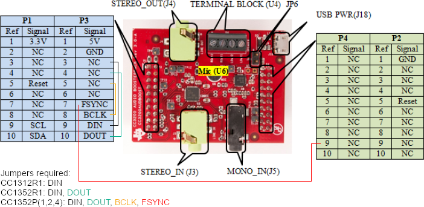

# SimpleLink&trade; CC1352R1 LaunchPad&trade; Settings & Resources

The [__SimpleLink&trade; CC1352R1 LaunchPad&trade;__][board] contains a
[__CC1352R1F3RGZR__][device] device.

## Jumper Settings

* Close the __`LEDs`__ jumpers to enable the on-board LEDs.
* Close the __`RXD<<`__ and __`TXD>>`__ jumpers to enable UART via the XDS110 on-board USB debugger.
* In order to get the lowest shutdown current (see the
  `gpioshutdown` example), remove the jumpers for the __`TCK`__ and __`TMS`__
  JTAG pins. TMS and TCK have internal pull-up and are driven low when
  inactive from the emulator, hence after programming the device these jumpers
  should be removed to avoid the extra leakage current.

## SysConfig Board File

The [CC1352R1_LAUNCHXL.syscfg.json](../.meta/CC1352R1_LAUNCHXL.syscfg.json)
is a handcrafted file used by SysConfig. It describes the physical pin-out
and components on the LaunchPad.

## Driver Examples Resources

Examples utilize SysConfig to generate software configurations into
the __ti_drivers_config.c__ and __ti_drivers_config.h__ files. The SysConfig
user interface can be utilized to determine pins and resources used.
Information on pins and resources used is also present in both generated files.

## TI BoosterPacks&trade;

The following BoosterPacks are used with some driver examples.

### [__BOOSTXL-SHARP128 LCD & SD Card BoosterPack__][boostxl-sharp128]

* No modifications are needed.

### [__BP-BASSENSORSMKII BoosterPack__][bp-bassensorsmkii]

* No modifications are needed.

### [__CC3200 Audio BoosterPack__][cc3200audboost]

The BoosterPack's `DIN` and `DOUT` signal pins are not compatible with this
LaunchPad. Do the following modifications to enable the CC3200 Audio
BoosterPack's usage with the __i2secho__ example.

Attach the CC3200 Audio BoosterPack to the CC1352R1_LAUNCHXL and run jumper wires
between the following pins on the CC3200 Audio BoosterPack:

* DIN: `P3.3` and `P3.9`
* DOUT: `P3.4` and `P3.10`

See [Audio BP User Guide][cc3200audboost-user-guide] (Figure 2-1), or the diagram
below, for information on where these pins are located.

[device]: https://www.ti.com/product/CC1352R
[board]: https://www.ti.com/tool/LAUNCHXL-CC1352R1
[boostxl-sharp128]: https://www.ti.com/tool/BOOSTXL-SHARP128
[bp-bassensorsmkii]: https://www.ti.com/tool/BP-BASSENSORSMKII
[cc3200audboost]: https://www.ti.com/tool/CC3200AUDBOOST
[cc3200audboost-user-guide]: https://www.ti.com/lit/pdf/swru383
